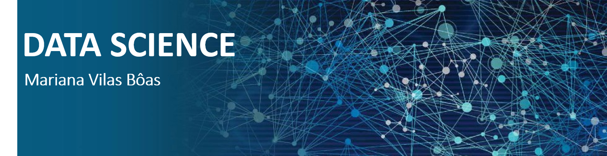

  

  

# Mariana Vilas Bôas
Engenheira de Produção PUC-Rio

*Estudante de Data Science*

Tenho experiência nas áreas financeira e de auditoria na indústria de Óleo & Gás. Atualmente, trabalho no mercado financeiro com suporte à fundos de investimento com ênfase na gestão de riscos. 

**Background in:** C++.

**Links:**
* [LinkedIn](https://www.linkedin.com/in/marianaboas/)

## Projetos:

* [**Análise dos dados do Airbnb - Nova Iorque**](https://github.com/MarianaVilasBoas/Portfolio/blob/main/Analisando_os_Dados_do_Airbnb_ipynb_Nova_Iorque.ipynb)
---
* [**Machine Learning - Detecção de Fraude em Cartões de Crédito**](https://github.com/MarianaVilasBoas/Portfolio/blob/main/Detec%C3%A7%C3%A3o_de_Fraude_em_Cart%C3%B5es_de_Cr%C3%A9dito.ipynb)

